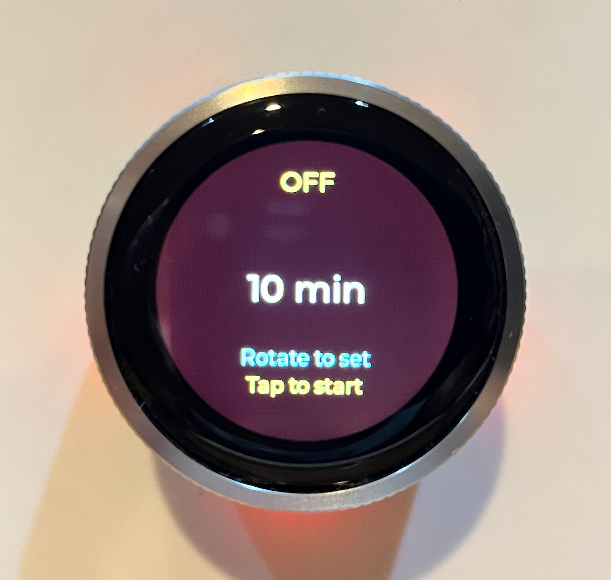

# CrowPanel ESPHome Workspace

ESPHome + LVGL firmware for the Elecrow CrowPanel 1.28-inch ESP32-S3 rotary
touch display.

The main firmware, [`esphome/crowpanel.yaml`](esphome/crowpanel.yaml), turns the
round touch display and rotary encoder into a Home Assistant EGO charger timer:
rotate to set the timer, tap or press to start/stop, and watch the arc, power,
state, and status messages update from Home Assistant.

| Stopped | Charging |
| --- | --- |
|  |  |

## Why This Repo Exists

This project is both a working firmware and a reproducible bring-up notebook.
It captures the small details that make CrowPanel development much smoother:
ESPHome/LVGL structure, Home Assistant helper entities, workbench-safe flashing,
serial-monitor caveats, physical camera verification, and known-good diagnostic
examples.

The development path is:

```text
Mac -> VS Code SSH -> Linux host -> Docker/devcontainer -> ESP workbench -> SLOT1 CrowPanel
```

## Hardware

Target device:
[Elecrow CrowPanel 1.28inch-HMI ESP32 Rotary Display](https://www.elecrow.com/crowpanel-1-28inch-hmi-esp32-rotary-display-240-240-ips-round-touch-knob-screen.html)

Useful hardware references:

- [Elecrow CrowPanel wiki](https://www.elecrow.com/wiki/CrowPanel_1.28inch-HMI_ESP32_Rotary_Display.html)
- [Local CrowPanel hardware facts](docs/reference/crowpanel/hardware-facts.md)
- [Project sources and references](docs/project-sources.md)

## What Is Included

- [`esphome/crowpanel.yaml`](esphome/crowpanel.yaml) - main EGO charger timer
  firmware for the CrowPanel.
- [`config/home-assistant/ego-charger-helpers.yaml`](config/home-assistant/ego-charger-helpers.yaml)
  - Home Assistant helper entities used by the firmware.
- [`examples/`](examples/) - small ESPHome examples and CrowPanel diagnostics.
- [`tools/`](tools/) - workbench helpers for validation, serial logs, flashing,
  and camera capture.
- [`docs/`](docs/) - bring-up notes, safety notes, test plans, source links, and
  repeatable workflows.

## Quick Start

Clone the repo on the Linux host connected to the ESP workbench:

```bash
mkdir -p ~/src
cd ~/src
git clone https://github.com/flavio-fernandes/crowpanel-esphome.git
cd crowpanel-esphome
```

Create local-only config files:

```bash
cp config/workbench.env.example config/workbench.env
cp esphome/secrets.yaml.example esphome/secrets.yaml
```

Edit both files for your network. The template is
[`esphome/secrets.yaml.example`](esphome/secrets.yaml.example), but the real
`esphome/secrets.yaml` stays local and ignored by git.

Install or include the Home Assistant package from
[`config/home-assistant/ego-charger-helpers.yaml`](config/home-assistant/ego-charger-helpers.yaml),
then make sure your charger switch and power sensor match the substitutions at
the top of [`esphome/crowpanel.yaml`](esphome/crowpanel.yaml).

Build or open the devcontainer and compile the firmware:

```bash
devcontainer up --workspace-folder .
devcontainer exec --workspace-folder . esphome config esphome/crowpanel.yaml
devcontainer exec --workspace-folder . esphome compile esphome/crowpanel.yaml
```

Flash only after a successful compile of that same YAML:

```bash
devcontainer exec --workspace-folder . tools/espwb-esptool flash-id
devcontainer exec --workspace-folder . tools/espwb-esptool write-flash 0x0 esphome/.esphome/build/crowpanel/.pioenvs/crowpanel/firmware.factory.bin
```

For the full fresh-clone workflow, including secrets, Home Assistant helpers,
compile paths, flashing, monitoring, and camera verification, start here:
[`docs/esphome-fresh-clone-flash-cheatsheet.md`](docs/esphome-fresh-clone-flash-cheatsheet.md).

## Documentation Map

Start with the guide that matches what you are doing:

- New checkout to flashed firmware:
  [`docs/esphome-fresh-clone-flash-cheatsheet.md`](docs/esphome-fresh-clone-flash-cheatsheet.md)
- Short workbench command reference:
  [`docs/esphome-workbench-cheatsheet.md`](docs/esphome-workbench-cheatsheet.md)
- CrowPanel hardware and LVGL notes:
  [`docs/reference/crowpanel/README.md`](docs/reference/crowpanel/README.md)
- CrowPanel ESPHome/LVGL implementation notes:
  [`docs/reference/crowpanel/esphome-lvgl-notes.md`](docs/reference/crowpanel/esphome-lvgl-notes.md)
- EGO charger UI behavior notes:
  [`docs/ego-charger-timer-ui.md`](docs/ego-charger-timer-ui.md)
- Production test matrix:
  [`docs/ego-charger-production-test-matrix.md`](docs/ego-charger-production-test-matrix.md)
- Examples overview:
  [`examples/README.md`](examples/README.md)
- ESPHome config notes:
  [`esphome/README.md`](esphome/README.md)
- Local config rules:
  [`config/README.md`](config/README.md)
- Source links and external references:
  [`docs/project-sources.md`](docs/project-sources.md)
- Release hygiene:
  [`docs/public-release-checklist.md`](docs/public-release-checklist.md)

## Safety Rules

- Flash only `SLOT1` unless you explicitly decide otherwise.
- Use [`tools/espwb-esptool`](tools/espwb-esptool) for `chip-id`, `flash-id`,
  `read-flash`, and `write-flash`.
- Use RFC2217 only for serial monitoring through
  [`tools/espwb-monitor`](tools/espwb-monitor).
- Do not use RFC2217 reset control for flashing.
- Keep `config/workbench.env`, `esphome/secrets.yaml`, firmware binaries, and
  local captures out of commits unless a file is intentionally documented.

## Thanks

Special thanks to [Andreas Spiess](https://www.sensorsiot.org/) for the
Universal Embedded Workbench/devcontainer inspiration and to
[Vaclav Chaloupka](https://github.com/bruxy70) for the CrowPanel and Home
Assistant/ESPHome development trail. Their videos and repositories are
collected in [`docs/project-sources.md`](docs/project-sources.md), along with
Elecrow's official product, wiki, course, and example links.
