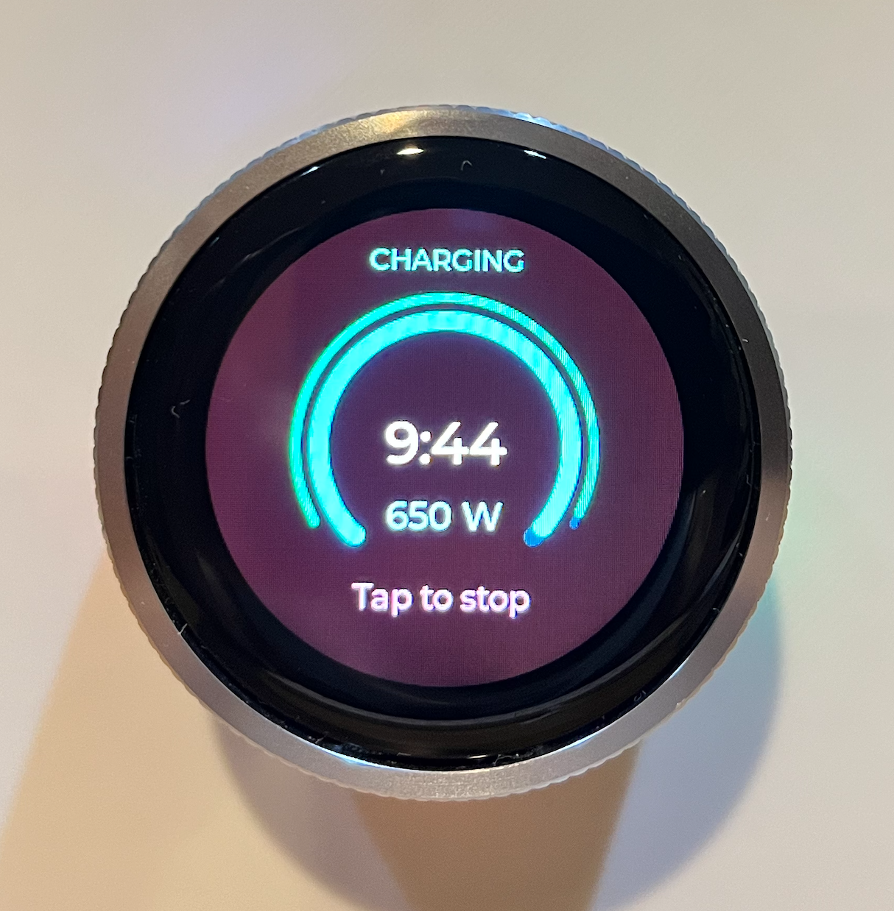

# CrowPanel ESPHome Workspace

ESPHome + LVGL firmware for the Elecrow CrowPanel 1.28-inch ESP32-S3 rotary
touch display, currently focused on a Home Assistant EGO charger timer UI in
`esphome/crowpanel.yaml`.



## Hardware

This repo targets the rotary CrowPanel with a round 240x240 touch display,
rotary encoder, push button, RGB LEDs, ESP32-S3, PSRAM, and 16MB flash.

- Product page:
  [CrowPanel 1.28inch-HMI ESP32 Rotary Display](https://www.elecrow.com/crowpanel-1-28inch-hmi-esp32-rotary-display-240-240-ips-round-touch-knob-screen.html)
- Vendor wiki:
  [CrowPanel 1.28inch-HMI ESP32 Rotary Display](https://www.elecrow.com/wiki/CrowPanel_1.28inch-HMI_ESP32_Rotary_Display.html)
- Local hardware notes:
  `docs/reference/crowpanel/hardware-facts.md`

## What Is Here

- `esphome/crowpanel.yaml` - the main CrowPanel EGO charger timer firmware.
- `config/home-assistant/ego-charger-helpers.yaml` - Home Assistant helpers used
  by the main firmware.
- `examples/` - small ESPHome examples and CrowPanel diagnostics.
- `tools/` - workbench-safe helpers for validation, serial logs, flashing, and
  camera capture.
- `docs/esphome-fresh-clone-flash-cheatsheet.md` - the end-to-end fresh clone,
  secrets, compile, and flash workflow.

## Quick Start

Clone on the Linux host connected to the ESP workbench:

```bash
mkdir -p ~/src
cd ~/src
git clone https://github.com/flavio-fernandes/crowpanel-esphome.git
cd crowpanel-esphome
```

Create local-only workbench and ESPHome secret files:

```bash
cp config/workbench.env.example config/workbench.env
cp esphome/secrets.yaml.example esphome/secrets.yaml
```

Edit both files for your network. Keep real Wi-Fi credentials, API keys, SSH
keys, and `secrets.yaml` out of git.

Install or include the Home Assistant helper package from
`config/home-assistant/ego-charger-helpers.yaml`, then make sure your charger
switch and power sensor match the substitutions at the top of
`esphome/crowpanel.yaml`.

Build or open the devcontainer and compile the main firmware:

```bash
devcontainer up --workspace-folder .
devcontainer exec --workspace-folder . esphome config esphome/crowpanel.yaml
devcontainer exec --workspace-folder . esphome compile esphome/crowpanel.yaml
```

Flash only after a successful compile of that same YAML:

```bash
devcontainer exec --workspace-folder . tools/espwb-esptool flash-id
devcontainer exec --workspace-folder . tools/espwb-esptool write-flash 0x0 esphome/.esphome/build/crowpanel/.pioenvs/crowpanel/firmware.factory.bin
```

The full version of this workflow lives in
`docs/esphome-fresh-clone-flash-cheatsheet.md`.

## Safety Rules

- Flash only `SLOT1` unless you explicitly decide otherwise.
- Use `tools/espwb-esptool` for `chip-id`, `flash-id`, `read-flash`, and
  `write-flash`.
- Use RFC2217 only for serial monitoring through `tools/espwb-monitor`.
- Do not use RFC2217 reset control for flashing.
- Keep `config/workbench.env`, `esphome/secrets.yaml`, firmware binaries, and
  local captures out of commits unless a file is intentionally documented.

## Useful Docs

- Fresh clone to flashed firmware:
  `docs/esphome-fresh-clone-flash-cheatsheet.md`
- Short workbench command reference:
  `docs/esphome-workbench-cheatsheet.md`
- CrowPanel ESPHome notes:
  `docs/reference/crowpanel/esphome-lvgl-notes.md`
- Home Assistant production test plan:
  `docs/ego-charger-production-test-matrix.md`
- Local config rules:
  `config/README.md`
- Public release checklist:
  `docs/public-release-checklist.md`
